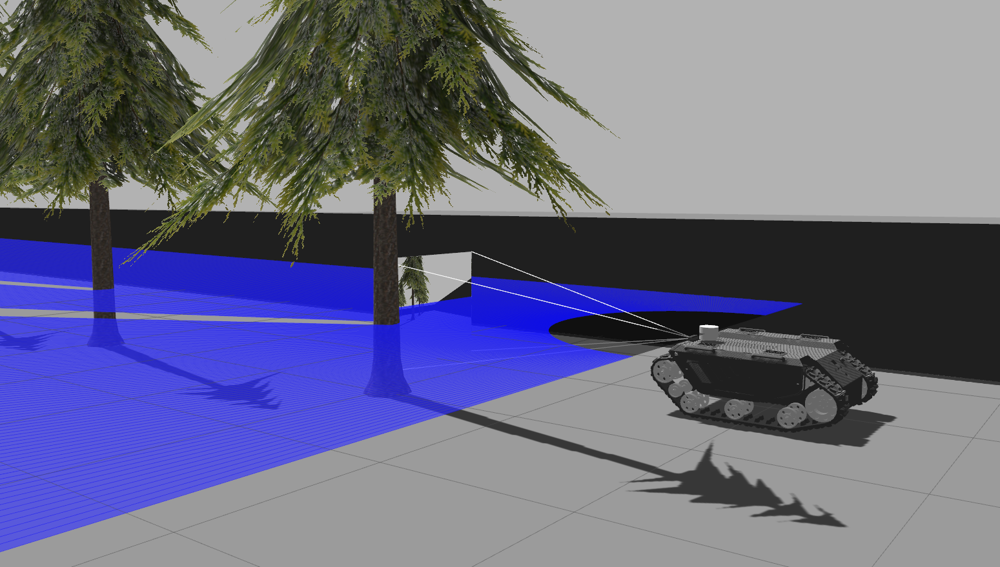

# Gazebo Terrain Tutorial

This package is used to demonstrate how to create custom terrains and use them in Gazebo simulations. This ROS package provides startup, world, and model files for loading custom terrains into Gazebo and spawning bunker robots on top of the terrain.

## Installation

1. Switch the terminal to <catkin_ws> and run

        $ cd ~/catkin_ws/
        $ source devel/setup.bash
        $ roslaunch gazebo_terrain test_gazebo.launch
        
        $ roslaunch gazebo_terrain test_rviz.launch
        
2. autonomous control

        $ cd ~/catkin_ws/src/robot_control/src
        $ python test_together.py

3. keyboard control

        $ rosrun teleop_twist_keyboard teleop_twist_keyboard.py

4. show node relationships

        $ rqt_graph
        
5. Drawing

        $ rosrun plotjuggler plotjuggler

At this point, Gazebo should have launched, loaded the custom terrain, and
spawned a Clearpath Husky robot onto the terrain. A common mistake is to forgot
to source the Gazebo environment in step 2.
